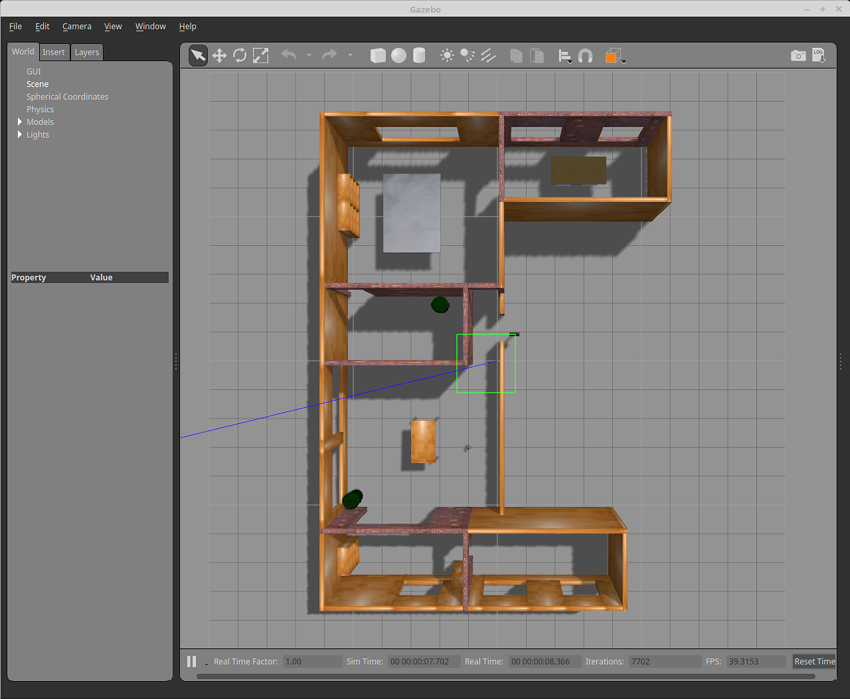

# Delivery_Bot
## A service bot delivering food in restaurant using ROS2 


[](https://github.com/AnukritiSinghh/delivery_bot/actions/workflows/build_and_coveralls.yml)

[](https://coveralls.io/github/AnukritiSinghh/delivery_bot)

[](https://opensource.org/licenses/Apache-2.0)

## Team
1) Anukriti Singh 
2) Joshua Arup Gomes  
3) Mayank Sharma 

## Overview

In the foodservice industry it has become incedibly challenging to deliver food and beverages seamlessly and efficiently, every day. Humans tend to get distracted and tired, they also need break and holidays. However, this all can be avoided by using the state of the art technology. With delivery robots, the orders can be delivered to the custromors with precision and effeciency. It is also a way to reduce labor costs, while others see it as a way to improve the customer experience, but regardless of which side you are on, the restaurant robotics is definitely coming. $235 billion are paid annually in restaurant wages in the U.S. and the foodservice industry has a $95 billion annual turnover cost. Some estimates indicate robotics can save between 30% and 70% on labor cost for restaurants. In such a scenario, we can balance this out by using robots in the workforce. 
We are using ros2 turtlebot burger for our prototype to achieve the task. Our tasks are two phased:
* First, navigation from position A to position B 
* Secondly, take the food and avoid obstacle autonomously to reach the customer table


## Deliverables
* Project: Project is search and deliver robot for restaruant dining
* Overview of prosposed work
* UML and activity diagrams
* Developer-level documentation

## Presentation slides
[Link](https://drive.google.com/file/d/1skqSzquj8Vp6N86IX2OeqfJ60_TsG-lV/view?usp=sharing)

## Dependencies with licenses
* Ubuntu 22.04 LTS
* C++
* CMake
* Git 
* Travis CI
* Coveralls
* ROS2 Humble
* RVIZ
* Gazebo
* Rostest
* Gtest
* TurtleBot3


## Development Process
Following the Agile Iterative Process for Development, we switch roles of driver, navigator and design keeper.
 
Phase 1:
1) Anukriti Singh (driver)
2) Joshua Arup Gomes (design keeper)
3) Mayank Sharma (navigator) 

For phase 2:
1) Anukriti Singh (navigator)
2) Joshua Arup Gomes (driver)
3) Mayank Sharma (design keeper)

For phase 3:
1) Anukriti Singh (design keeper)
2) Joshua Arup Gomes (navigator)
3) Mayank Sharma(driver)
 

* Product backlog, iteration backlog and worklog:  [here](https://docs.google.com/spreadsheets/d/1dZ-y45_AL5Mc8_DbIJrSJJ0H6H_2HLId_zzahEZlHxE/edit#gid=2139171243) 
* Sprint planning: [here](https://docs.google.com/document/d/1f-xjoKFd7hRqJ0oETVylUt3rAWTCG6LZAqg9HKFyrsw/edit)

## Enviornment



## Static Code analysis
* Cppcheck results can be found [here](https://github.com/AnukritiSinghh/Delivery_Bot/blob/phase_3/results/cpplint_and_cppcheck_result.txt)
* Cpplint results can be found [here](https://github.com/AnukritiSinghh/Delivery_Bot/blob/phase_3/results/cpplint_and_cppcheck_result.txt)

## Installation

The following steps walkthrough the procedure to install the lastest LTS version of ROS2 (Humble) on an Ubuntu 20.04 machine, from source code. These steps can be found in [this link](http://docs.ros.org/en/humble/Installation/Alternatives/Ubuntu-Development-Setup.html).

If your system is running Ubuntu Linux Jammy (22.04) 64-bit, you may skip to the binary installation of ROS2 Humble using 
[this link.](http://docs.ros.org/en/humble/Installation/Ubuntu-Install-Debians.html)

```
. <path-to-ROS2-installation>/ros2_humble/install/local_setup.bash
```
### TurtleBot3 Installation

If you have a debian installation of ROS on your system, the steps to install TurtleBot3 packages are given [here](https://emanual.robotis.com/docs/en/platform/turtlebot3/quick-start/) with ```foxy``` replaced with your corresponding ROS distribution.

For a source installation of ROS2, the steps to install Gazebo and Turtlebot3 packages can be found [here](http://classic.gazebosim.org/tutorials?tut=ros2_installing&cat=connect_ros) and [here](https://ros2-industrial-workshop.readthedocs.io/en/latest/_source/navigation/ROS2-Turtlebot.html).

## ROS2 Workspace

Here, an overlay workspace on top of the underlay installation workspace shall be created to place the custom-defined ROS2 packages. 
```
. <path-to-ROS2-installation>/ros2_humble/install/local_setup.bash
mkdir -p <path-to-ROS2-workspace>/ros2_ws/src
cd <path-to-ROS2-workspace>/ros2_ws/src
```
Source the 'underlay' installation workspace followed by the 'overlay',
```
. <path-to-ROS2-installation>/ros2_humble/install/local_setup.bash
cd <path-to-ROS2-workspace>/ros2_ws
. install/setup.bash
```

## Build Instructions

* In your workspace src folder(EX: /ros_ws/src) 

```
git clone https://github.com/AnukritiSinghh/Delivery_Bot.git
. install/setup.bash 
colcon build
```
## Run Instructions

* To spawn at a specific point, such as (0,0), enter the following command
```
export TURTLEBOT3_MODEL=burger
ros2 launch Delivery_Bot obstacle_course.launch.py x_pose:=0 y_pose:=0
````

* To run RVIS2 and the cartographer:
In a new terminal in your workspace type:

```
. install/setup.bash 
export TURTLEBOT3_MODEL=burger
ros2 launch Delivery_Bot cartographer.launch.py \
use_sim_time:=True
```

* To run the obstacle avoidance program: 

In a new terminal in your workspace:
```
. install/setup.bash 
export TURTLEBOT3_MODEL=burger
ros2 launch Delivery_Bot  hamburger_walker.launch.py
```

* To enable a ROSbag recording:
```
ros2 launch Delivery_Bot  hamburger_walker.launch.py enable_recording:=True
```
The Hamburger is now moving around the world, creating a map   
To save the map, enter the following command map
```
ros2 run nav2_map_server map_saver_cli -f obstacle_sample_map
```
* Run Rvis with the map:

Using the created map, the user now can use RVIS to set the desired endpoint of a turtlebot, assuming a complete map is taken.
```
ros2 launch Delivery_Bot obstacle_course.launch.py
```
In a new terminal in your workspace
```
. install/setup.bash 
export TURTLEBOT3_MODEL=burger
ros2 launch Delivery_Bot cartographer.launch.py\
use_sim_time:=true map:=maps/"you map name".yaml
```

The user can denote the end and start point for the Hamburger in RVIS 

## Known issues

* Could not make own rvis launch file, had issues finding turtlebot3_lds_2d.lua,
reliant on turtlbot source code.

```
colcon build --packages-select hamburger_cartographer 
```
This map is created automatically.
One could manually control the turtle bot to move it around and record a more accurate map. 
Downside, a robot might be forever stuck in a room
Future development:

If for some reason RVIS doesnt accept the recorded map enter the following 
```
ros2 launch turtlebot3_navigation2 \
navigation2.launch.py \
use_sim_time:=true map:=maps/"you map name".yaml
```


